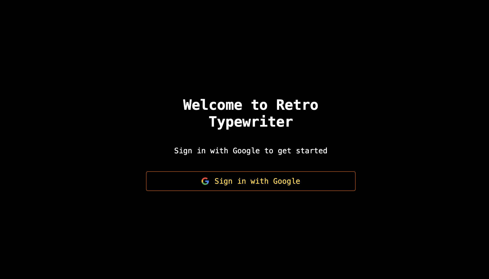

# 🖥️ Retro Typewriter with Auth 🎛️  
🔗 [Visit the App](https://retro-monitor.raimonvibe.com/)

Welcome to the **Retro Monitor** – a nostalgic, typewriter-style interface combined with secure user authentication.  
Inspired by vintage computing aesthetics 🧑‍💻, this app brings a fun and interactive experience to your modern browser.  

---

## 🧠 Features

- ⌨️ **Typewriter Animation** – Dynamic and retro-styled typing effect
- 🔐 **User Authentication** – Secure login system integrated with the typewriter UI
- 📋 **Multiple Choice Interaction** – Quiz-like questions with suggested answers
- 📱 **Fully Responsive** – Retro charm on both desktop and mobile

---

## 🚀 Getting Started

To run the app locally:

```bash
git clone https://github.com/raimonvibe/retro-typewriter-with-auth.git
cd retro-typewriter-with-auth
npm install
npm run dev
```

Then visit `http://localhost:3000`

---

## 🛠️ Tech Stack

- Next.js
- React
- Tailwind CSS
- Typewriter Effect
- JWT or session-based authentication

---

## 🖼️ Screenshot


---

## 👤 Author

Crafted with ❤️ by [Raimon](https://github.com/raimonvibe)

---

## 🔗 Live App

👉 [https://retro-monitor.raimonvibe.com/](https://retro-monitor.raimonvibe.com/)
